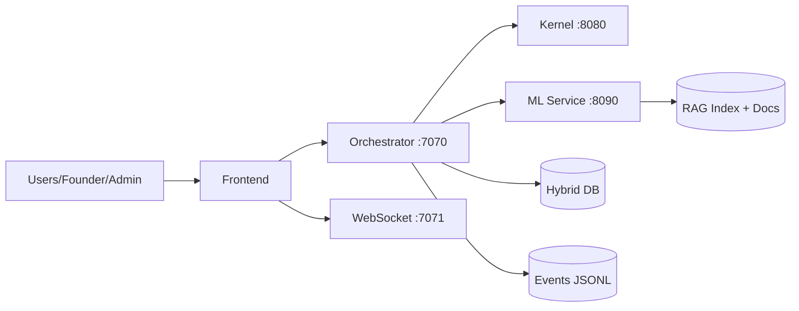
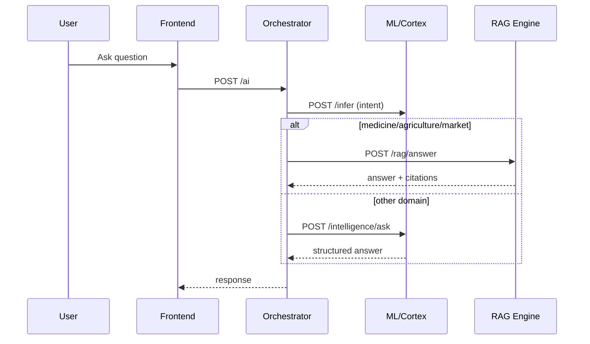
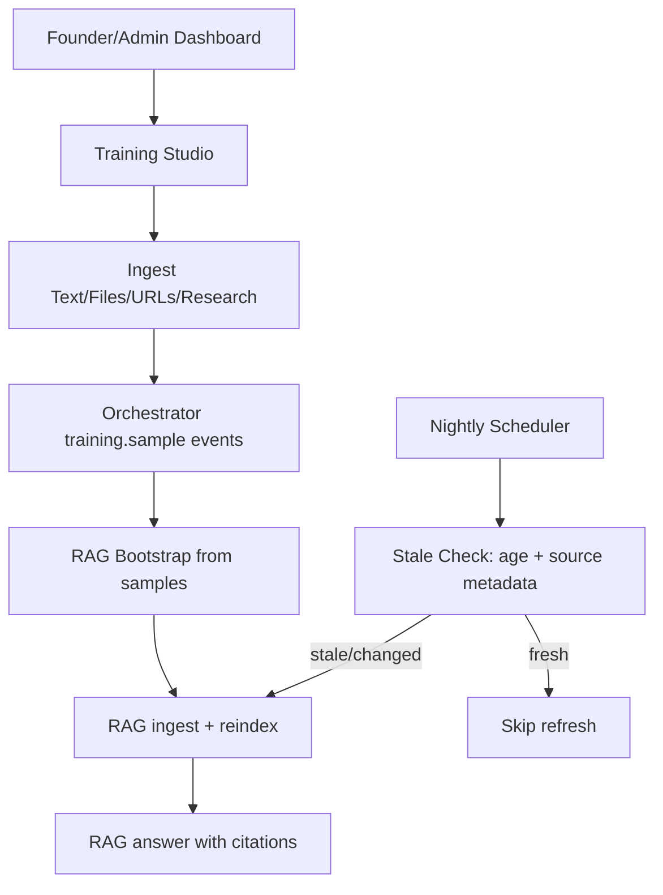
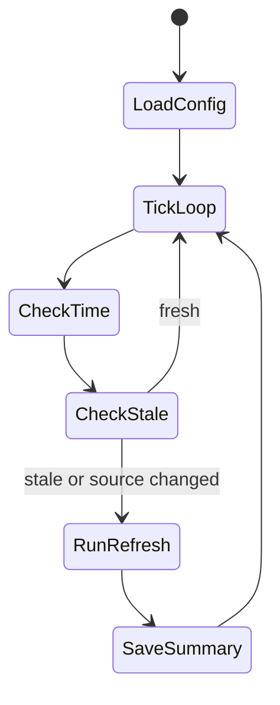
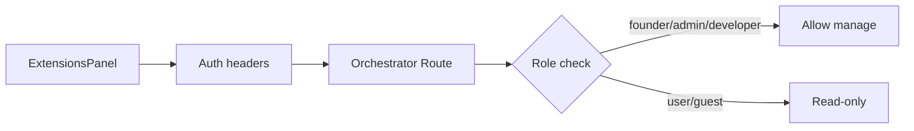

# NeuroEdge Architecture Diagrams

## 1) System Topology

## 2) Intelligence Request Path

## 3) Training + Bootstrap + Nightly Refresh

## 4) Auto-Refresh Config Runtime

## 5) Security/Role Control (Extensions example)

